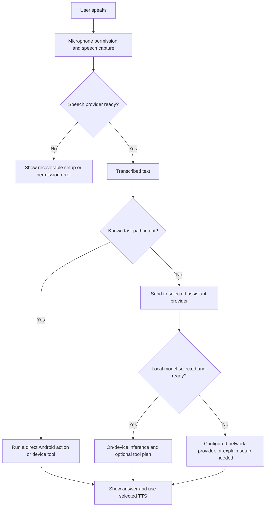
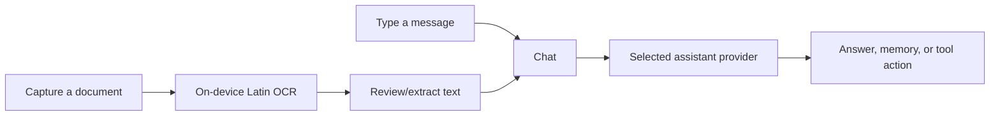
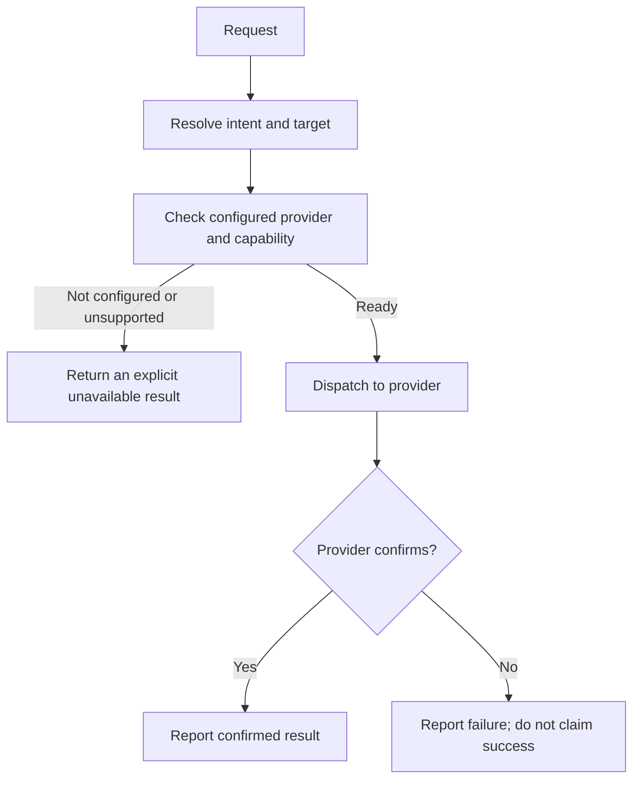

# ODIN — Open Device Intelligence Network

**A local-first Android assistant for voice, device actions, and smart-home workflows.**

> **Demo status:** ODIN's Android app and debug APK have been built. The project test suite passed locally. The latest UI, offline inference, camera/OCR, and speech paths still need hands-on validation on the target phone. See [the phone setup guide](setup.md) and [the real-device checklist](docs/real-device-smoke-test.md).

ODIN combines a local assistant, Android tools, voice interaction, and integration points for smart-home systems. “Local-first” describes the on-device options; cloud providers, news/weather feeds, and configured home integrations use network services.

**Project priority:** Priority 1 — make ODIN feel like an immediate, voice-first smart-home device. Current work also advances Priority 2 (local agent tools) and Priority 3 (UX and setup). See [the roadmap](docs/roadmap.md).

## Contents

- [At a glance](#at-a-glance)
- [What ODIN can do](#what-odin-can-do)
- [How a request flows](#how-a-request-flows)
- [Automation examples](#automation-examples)
- [Feature and connection status](#feature-and-connection-status)
- [Privacy and offline behavior](#privacy-and-offline-behavior)
- [Build and run](#build-and-run)
- [A ten-minute demo](#a-ten-minute-demo)
- [Eight-minute spoken demo script](demo.md)
- [Project map](#project-map)
- [Development and quality](#development-and-quality)
- [Known limits](#known-limits)
- [More documentation](#more-documentation)

## At a glance

| Item | Current project value |
|---|---|
| Version | `0.1.0` (`versionCode` 1) |
| Minimum Android version | Android 9 / API 28 |
| Target / compile SDK | API 35 |
| Android build | Kotlin 2.1, Compose, Material 3, Hilt |
| Device architecture in this build | `arm64-v8a` |
| Local model runtime | LiteRT-LM / MediaPipe paths, depending on model family |
| OCR | Bundled ML Kit Latin text recognizer; processing is on-device |
| Smart-home providers | Home Assistant, MQTT, SwitchBot, and a Matter integration boundary |
| Built debug APK | `app/build/outputs/apk/full/debug/app-full-debug.apk` (`full` speech-runtime flavor) |

The full APK is large (about 233 MiB in the current build) because it includes native libraries. A language model and some speech assets are separate downloads. The `full` flavor includes an additional speech runtime; its data pack is downloaded only if that engine is used. `standard` omits that embedded runtime.

## What ODIN can do

### Talk, listen, and respond

- Open the chat screen from the Home screen and send a typed prompt to the selected assistant provider.
- Use speech input with the configured speech-recognition provider. Vosk is the intended offline English option after its model is available; Whisper is another offline path after its native/model prerequisites are met.
- Speak replies with the selected text-to-speech provider. The operating system's installed TTS voice is a practical fallback. The current project diagnostics document the Piper native-runtime boundary; selecting or downloading a Piper voice by itself does not prove Piper inference is active.
- Route common requests directly to fast-path actions such as date/time, timers, and volume, without asking the LLM to plan those actions.

### Use the on-device assistant

- Select the embedded/local assistant and download a compatible model in setup or Settings. Model discovery/download requires internet access. Once the model and required assets are present, supported inference can run on the phone without sending prompts to an AI API.
- Use chat, conversation history, local memory, bundled skills, routines, and tool calls. The assistant's result depends on the selected model and available tools; passing unit tests does not establish answer quality on every phone.
- Optionally configure an API-compatible or OpenClaw provider. These are network-based and are not required for the local mode.

### Try camera text scanning

In chat, choose the scan-text/camera action, capture a page, and review the recognized text. The bundled Latin OCR model processes the captured image on-device, including with no internet after installation. Use a clear, well-lit page and check the extracted text before asking ODIN to act on it. This is **OCR**, not YOLO object detection or general image understanding. The camera/OCR path awaits the phone check.

### Control connected devices

ODIN has provider abstractions for Home Assistant, MQTT, SwitchBot, and Matter. Real device actions require the relevant service, credentials, network access, pairing, and (for some capabilities) native integration work. A provider existing in the app does not mean a device is already connected. Matter's command dispatcher currently fails closed where native cluster control is unavailable. Read [provider notes](docs/providers.md) before connecting real devices.

## How a request flows

### Voice request



### Text and scanned document request



### Safe smart-home action shape



## Automation examples

These examples describe bundled skill/routine patterns. Actions that mention lights, speakers, or other appliances need those devices and their provider configured. Review a routine before enabling it.

| Example | Trigger | Possible steps | Needs |
|---|---|---|---|
| Morning briefing | “Give me my morning briefing” | Read date/time, calendar if granted, and available news/weather | Network for feeds; calendar permission for events |
| Cooking timer | “Set a timer for 8 minutes” | Start timer and announce completion | Android notification/foreground behavior allowed |
| Focus session | “Start focus mode” | Start a Pomodoro-style timer; optionally quiet connected devices | Timer; provider/device config for smart-home steps |
| Arrive home | “I’m home” | Run configured arrival routine and summarize context | Location or explicit trigger; configured devices |
| Quick note | “Remember that I parked on level 3” | Save a note to local memory and retrieve it later | Local storage |
| Scan a printed note | Capture page in chat | OCR text locally, then summarize or extract a date | Camera permission; clear Latin text |
| Goodnight | “Goodnight” | Run the configured bedtime steps, such as timer or lights | Each optional integration configured; review before use |

ODIN does not silently gain access to accounts or devices. Android runtime permissions and integration setup still apply. For bundled skill details see [skills](docs/skills.md), and for proactive suggestions see [proactive rules](docs/proactive-rules.md).

## Feature and connection status

| Area | Implemented in project | Still required / status |
|---|---|---|
| Home dashboard and chat UI | Compose screens, Home dashboard, Chat entry | Latest interface needs real-phone visual check |
| Local assistant | Embedded provider and model download flow | Download a compatible model; verify response quality and offline inference on the phone |
| Fast-path tools | Intent matchers and Android tool abstractions | Grant permissions; validate each action on target Android/OEM |
| English offline speech input | Vosk provider and configurable model path | Install/verify speech model and microphone behavior on the phone |
| Offline Whisper | Native integration and model management | Download a model and validate native loading, accuracy, and latency on the phone |
| Camera OCR | Capture flow and bundled Latin recognizer | Grant camera permission and verify capture/OCR on the phone |
| TTS | Provider selection and Android TTS fallback | Confirm an installed English voice; Piper JNI is not currently packaged |
| Home Assistant / MQTT / SwitchBot | Provider code and settings | Configure endpoint/credentials and test against actual devices |
| Matter | Provider boundary | Native cluster dispatcher/device acceptance remains a known gap |
| Weather and headlines | Dashboard/feed integrations | Network required; live data is not available in airplane mode |
| Multi-room | Discovery/protocol code | Pair devices on same network and perform physical acceptance |

Status reflects source and local build evidence, not a claim that every row was accepted on a physical phone. The phone check should record which rows actually pass.

## Privacy and offline behavior

ODIN offers local inference and on-device tools. Choose **Local / on-device** and wait for model setup to finish before using offline chat. The initial APK installation, model download, speech asset downloads, news/weather, cloud providers, and many device integrations may use the network. Encrypted preferences protect configured secrets at rest; see [privacy notes](docs/privacy.md).

| Feature | Can work offline after setup? | Notes |
|---|---:|---|
| Local text inference | Yes, when a compatible model is downloaded and loaded | Device performance and memory vary |
| Camera text OCR | Yes | Bundled Latin recognition model; phone validation pending |
| Local memory and timers | Generally | Android may restrict background work or notifications |
| Vosk speech recognition | Yes, after its model is installed | Verify the selected provider/model first |
| Whisper speech recognition | Yes, after native library and model are ready | See [offline smoke checklist](docs/offline-stack-smoke-test.md) |
| Weather, web search, and headlines | No live results | Require network sources |
| HA, MQTT, SwitchBot, Matter | Usually needs local network/provider | Connection and device availability matter |
| Cloud/API assistant | No | Sends requests to the configured service |

For a meaningful offline check: finish all downloads on Wi-Fi, open ODIN once, wait for the local model to load, test a simple local prompt, then enable airplane mode and repeat. An “offline-capable” code path is not proof of a successful device run.

## Build and run

For the exact beginner-friendly Windows instructions, Android setup, installation commands, first-run steps, and wireless debugging guide, follow **[setup.md](setup.md)**.

Quick build from the repository root:

```powershell
.\gradlew.bat assembleFullDebug
```

The current demo APK is:

```text
app\build\outputs\apk\full\debug\app-full-debug.apk
```

The `fullDebug` variant is a debug-signed, arm64 APK intended for development/demo installation. It is not a Play Store release. The project has no emulator configured in the current workspace, so a successful build alone does not verify the UI on a phone.

## A ten-minute demo

This outline demonstrates the experience without claiming a connection to unconfigured devices.

| Time | Show | Example action | What to say |
|---:|---|---|---|
| 0:00–1:00 | Home dashboard | Show Bengaluru location, clock, and dashboard | “ODIN is designed as a local-first assistant for a shared home display.” |
| 1:00–2:00 | Chat | Open Chat and show suggested prompts | “The same assistant has a typed path, so it remains useful when speech is inconvenient.” |
| 2:00–3:30 | Local model | Ask a short prompt, e.g. “Give me three ideas for a calm evening.” | “This run uses the selected on-device model.” Show local provider setting; avoid a long complex prompt. |
| 3:30–4:30 | Fast path | Ask for current time or a one-minute timer | “Simple intents can take a direct tool path instead of waiting for model planning.” |
| 4:30–6:00 | OCR | Scan a printed note and ask for its date or key sentence | “The text is recognized on-device; inspect it before using it.” |
| 6:00–7:15 | Voice | Use the mic for a short English request | “Speech depends on the selected recognizer and installed model.” |
| 7:15–8:30 | Offline check | Enable airplane mode and repeat a local prompt/OCR | “The local paths keep working after setup; live headlines and weather need a network.” |
| 8:30–9:30 | Smart-home architecture | Show provider settings or a preconfigured test device | Only claim control if a real provider/device has been configured and confirmed. |
| 9:30–10:00 | Close | Recap privacy and integration roadmap | State what was physically demonstrated and what remains a provider setup step. |

**Demo fallback:** if voice or a provider misbehaves, use typed chat and OCR, and narrate the failure honestly. Avoid putting API keys, pairing codes, private notifications, or personal documents on screen.

## Project map

Application code is organized under `app/src/main/java/` by feature.

| Folder | Responsibility |
|---|---|
| `assistant/` | Providers, routing, tools planning, skills, routines, memory/context |
| `device/` | Smart-home provider abstractions and device manager |
| `voice/` | Speech pipeline, fast paths, diagnostics, STT/TTS integration |
| `tool/` | Android system tools, information, memory, RAG, accessibility |
| `ui/` | Compose Home, Dashboard, Chat, Settings, setup, and ambient screens |
| `permission/` | Permission catalog, repository, and Android permission intents |
| `service/` | Foreground voice services and Android receivers |
| `data/` | Room database and encrypted/preferences storage |

```text
Android UI (Compose)
       │
       ├── Chat / voice ── AssistantProvider ── Local model or configured remote provider
       │                         │
       │                         ├── tools / memory / skills / routines
       │                         └── device provider abstractions
       │                                  └── HA / MQTT / SwitchBot / Matter boundary
       └── Settings / permissions / model and speech setup
```

## Development and quality

Prerequisites and Android SDK details are in [setup.md](setup.md). Useful commands on Windows:

```powershell
.\gradlew.bat testDebugUnitTest
.\gradlew.bat assembleFullDebug
.\gradlew.bat lint
```

The repository instructions ask contributors to run tests after code changes. In the current work session, the full Gradle test task passed across all four variants (2,369 tests per variant, zero failures); `assembleFullDebug` also completed. These checks cover JVM/build behavior, not physical hardware, live provider credentials, OCR image quality, voice latency, or UI appearance on the target phone.

Project conventions and architecture are documented in [docs/conventions.md](docs/conventions.md) and [docs/architecture.md](docs/architecture.md). Contributions should identify the roadmap priority they advance and avoid adding dependencies without review.

## Known limits

- No claim of “zero errors on every phone” is possible before target-device testing. Android versions, OEM power rules, available RAM, microphone behavior, and TTS voices vary.
- Local model quality and speed depend on model size and the phone. Leave enough storage for the APK, model, download/cache, and speech assets.
- Full offline operation needs all selected models/assets downloaded first. News and weather are live network features.
- OCR currently means Latin text recognition from a captured image. It does not include YOLO object detection or a vision-language model.
- Smart-home settings must be configured and tested; Matter native cluster control is not complete.
- Piper's downloadable voice assets alone do not enable native Piper inference in this build. Android TTS can serve as fallback.
- English is the intended demo interface language; verify the phone’s language setting after install if Android restores another locale.

## More documentation

| Guide | Contents |
|---|---|
| [setup.md](setup.md) | Install tools, build APK, USB/wireless debugging, first launch, offline preparation, troubleshooting |
| [demo.md](demo.md) | Timed 8-minute finale script with exact spoken lines, screen actions, and failure fallbacks |
| [docs/architecture.md](docs/architecture.md) | Component architecture and data flow |
| [docs/providers.md](docs/providers.md) | Assistant and smart-home provider status |
| [docs/tools.md](docs/tools.md) | Tool catalog and permissions |
| [docs/privacy.md](docs/privacy.md) | Local data and network behavior |
| [docs/real-device-smoke-test.md](docs/real-device-smoke-test.md) | Physical-device checks |
| [docs/offline-stack-smoke-test.md](docs/offline-stack-smoke-test.md) | STT/TTS offline readiness boundaries |
| [docs/roadmap.md](docs/roadmap.md) | Project priorities and work status |

## License

See the repository license and third-party notices for applicable terms and acknowledgements.
