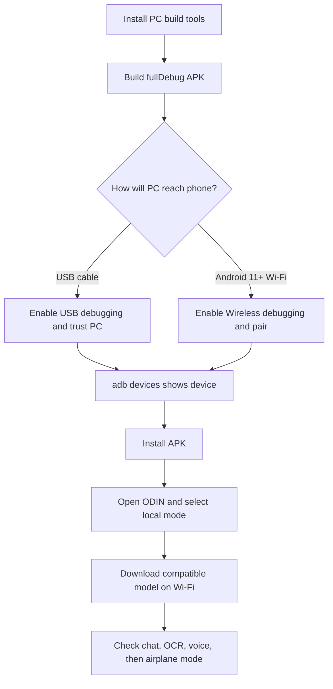

# ODIN phone setup — step by step

This guide takes you from the project folder on a Windows PC to ODIN running on an Android phone. It includes two ways to install: a USB cable or wireless debugging. You need to use **one** of them. Wireless debugging is optional; it is not needed to build the APK.

> **Phone testing status:** The project has a built `fullDebug` APK at `app/build/outputs/apk/full/debug/app-full-debug.apk`. Source/build checks passed, but the current UI, camera/OCR, local inference, and voice behavior have not yet been checked on the target phone. The next step after this guide is to connect the phone and install the APK.

## The short version

1. On the PC, install Java 17 and Android Studio (or Android command-line tools plus Android SDK components).
2. In PowerShell, build ODIN by running the command shown in the “Build the demo APK” section below.
3. On the phone, enable Developer options and USB debugging, **or** enable Wireless debugging (Android 11+).
4. Connect the PC to the phone with USB or pair ADB over Wi-Fi.
5. Install `app-full-debug.apk` and open ODIN.
6. Choose the local assistant, download a compatible model on Wi-Fi, grant only the permissions you want, and do the phone check.



## What you need

| Thing | Needed? | What it is for |
|---|---:|---|
| Windows PC with this project at `D:\open-dash-main` | Yes | Build the Android app and send it to the phone |
| Android phone with ARM 64-bit CPU, Android 9/API 28 or newer | Yes | Run the current app build; current APK includes `arm64-v8a` only |
| Internet on PC | First build | Gradle downloads build dependencies the first time |
| Internet on phone | First-run model/assets | Model catalog and model download; live headlines/weather also use network |
| Android Studio **or** command-line Android tools | One of these | Provides Android SDK components; Android Studio is easiest for a first setup |
| Java Development Kit (JDK) 17 | Yes | Runs Gradle; Android Studio can provide its bundled JDK |
| USB data cable | Optional | Simplest way to install and debug |
| Same Wi-Fi network on PC and phone | Optional | Needed for modern wireless ADB pairing |
| Several GB of free phone storage | Strongly recommended | APK plus selected model, model download/cache, and optional speech assets |

The current full debug APK is about 233 MiB. The model is separate and can be much larger. The model picker displays each model's size; check that number and keep extra free space for download and loading. No account or API key is needed for the local assistant. Do not choose a cloud/API provider if your goal is an offline demo.

## Part 1 — Prepare the PC

### Option A: Android Studio (easiest)

1. Download and install [Android Studio](https://developer.android.com/studio).
2. Start Android Studio. If it asks to import settings, choose the normal/default option.
3. Open **More Actions → SDK Manager** (or **Tools → SDK Manager** after a project is open).
4. In **SDK Platforms**, install **Android API 35** (Android 15).
5. In **SDK Tools**, install **Android SDK Platform-Tools**, **Android SDK Build-Tools**, **NDK (Side by side)**, and **CMake**.
6. In SDK Tools, turn on **Show Package Details**. Install NDK version **28.2.13676358** and CMake version **3.22.1**. These match this project's Gradle configuration.
7. Install a JDK 17 if you do not use Android Studio's bundled JDK. Android Studio's Gradle JDK setting is under **Settings → Build, Execution, Deployment → Build Tools → Gradle**. Choose the bundled JDK if it reports version 17.
8. Open the existing project folder `D:\open-dash-main` in Android Studio and wait for Gradle sync to finish. The first sync can take a while because it downloads dependencies.

You do **not** install Android Studio on the phone. It is a PC program.

### Option B: command-line tools only

If you already have Java 17 and Android SDK command-line tools, make sure these SDK packages are installed: `platform-tools`, `platforms;android-35`, `build-tools;35.0.0`, `ndk;28.2.13676358`, and `cmake;3.22.1`. Use SDK Manager from Android Studio, or `sdkmanager` from the command-line tools. For example, in PowerShell, after `sdkmanager` is on PATH:

```powershell
sdkmanager "platform-tools" "platforms;android-35" "build-tools;35.0.0" "ndk;28.2.13676358" "cmake;3.22.1"
```

If Gradle cannot find your Android SDK, create or update `local.properties` in the project root with your own SDK path, for example:

```properties
sdk.dir=C:/Users/YOUR_WINDOWS_NAME/AppData/Local/Android/Sdk
```

Replace `YOUR_WINDOWS_NAME` with your Windows account name. Do not copy that example literally. `local.properties` is machine-specific; do not commit it.

### Confirm Java and project folder

Open PowerShell and run:

```powershell
cd D:\open-dash-main
java -version
```

The Java output should show version 17. If `java` is not recognized, set Android Studio's Gradle JDK to its bundled JDK, or install JDK 17 and reopen PowerShell.

### Build the demo APK

In the same PowerShell window:

```powershell
cd D:\open-dash-main
.\gradlew.bat assembleFullDebug
```

Wait until it says `BUILD SUCCESSFUL`. The APK should be here:

```text
D:\open-dash-main\app\build\outputs\apk\full\debug\app-full-debug.apk
```

This `fullDebug` APK includes the additional embedded speech runtime. The standard flavor is smaller, but excludes that runtime. Neither flavor contains the speech data pack or a language model by default. The APK is debug-signed and intended for development/demo installation.

If the build fails:

1. Check that Java is version 17.
2. Check Android Studio SDK Manager for API 35, NDK `28.2.13676358`, and CMake `3.22.1`.
3. Check that the PC has internet and free disk space.
4. Re-run the build and copy the first clear `What went wrong` message if you need help.

## Part 2 — Pick one way to connect the phone

### Method A: USB cable (recommended for the first install)

#### Turn on Developer options

1. On the phone, open **Settings → About phone** (the exact label may be **About device**).
2. Find **Build number**. On some phones it is under **Software information** or **Version information**.
3. Tap **Build number** seven times. Enter the phone PIN if asked.
4. Go back to Settings. Open **System → Developer options**, or search Settings for “Developer options.” iQOO/Vivo menu names can differ slightly by model/version.
5. Turn **Developer options** on.
6. Turn **USB debugging** on.

#### Plug in and trust the PC

1. Connect the phone to the PC using a USB cable that transfers data (some cables only charge).
2. Unlock the phone. If a USB mode notification appears, choose **File transfer / Android Auto** or another data mode.
3. A phone dialog should ask **Allow USB debugging?** Check **Always allow from this computer** only if this is your own trusted PC, then tap **Allow**.
4. On the PC, open PowerShell in `D:\open-dash-main` and run:

```powershell
adb devices -l
```

If PowerShell says `adb` is not recognized, add Android SDK's `platform-tools` folder to PATH, or call adb by its full path, for example:

```powershell
& "$env:LOCALAPPDATA\Android\Sdk\platform-tools\adb.exe" devices -l
```

The phone should appear with state `device`. If it says `unauthorized`, look at the phone, accept the trust dialog, and run `adb devices -l` again. If no phone appears, try another cable/USB port and select data transfer mode.

### Method B: Wireless debugging (Android 11 and newer)

Wireless debugging is optional. Both devices need to be on the same normal Wi-Fi network. Guest Wi-Fi or a router setting called client/AP isolation can prevent them from seeing each other.

1. First do the **Developer options** steps above.
2. On the phone, open **Settings → System → Developer options → Wireless debugging**. On iQOO/Vivo, search Settings for **Wireless debugging** if the menu path differs.
3. Turn **Wireless debugging** on.
4. Tap **Pair device with pairing code**. Keep this screen open. It shows a temporary pairing IP/port and a six-digit pairing code.
5. On the PC, run the pairing command using the IP and port shown on the **pairing** screen:

```powershell
adb pair PHONE_IP:PAIRING_PORT
```

For example, if the phone shows `192.168.1.25` and pairing port `37123`, the command is `adb pair 192.168.1.25:37123`. When the terminal asks, type the temporary six-digit code shown on the phone. **Do not put your real code in this guide, a screenshot, or a public chat.**

6. On the phone's main **Wireless debugging** screen, find **IP address & port**. This is the separate **connection** port; it may differ from the pairing port.
7. Connect using that second address and port:

```powershell
adb connect PHONE_IP:CONNECT_PORT
adb devices -l
```

8. Confirm the new entry shows state `device`. Keep the phone awake while installing.

After installation, turn Wireless debugging off when you are done. Pairing codes are temporary, but leaving debugging enabled is unnecessary.

#### If the phone is Android 10 or older

The Wireless debugging pairing-code screen is an Android 11+ feature. Use USB if possible. Older Android versions may support `adb tcpip` after a USB connection, but that is a separate legacy workflow and should only be used on a trusted private network.

## Part 3 — Install and open ODIN

Make sure PowerShell is in the project folder:

```powershell
cd D:\open-dash-main
```

Confirm the phone is listed:

```powershell
adb devices -l
```

Install the APK:

```powershell
adb install -r "D:\open-dash-main\app\build\outputs\apk\full\debug\app-full-debug.apk"
```

The `-r` option updates the app while normally keeping its data. If Android asks whether to install the app, accept it on the phone. Open ODIN from the app drawer.

To replace it after another build, repeat `assembleFullDebug` and `adb install -r ...`. Do not uninstall during normal updates: uninstalling deletes ODIN's private model files, settings, and local app data.

## Part 4 — First launch and local model

Do this part while the phone has reliable Wi-Fi and is charging if possible.

1. Open ODIN and keep the phone unlocked.
2. If Android asks for microphone, camera, or notification permission, choose **Allow only for the feature you are trying**. Chat and local text inference do not require camera permission; the scan feature does.
3. At assistant setup, select **Local / on-device** (wording may vary) if the goal is local operation. A remote/API provider needs its own endpoint and credentials.
4. In model setup, wait for the available model list to load from Hugging Face. Select a model offered by ODIN, read its displayed download size, and tap **Download**. Keep ODIN open and the phone on Wi-Fi until it says the model is ready.
5. Choose a model the phone has enough free storage and memory to load. Smaller models usually start more easily on phones, though answer quality may be lower. Do not select a random file just because it is called “Gemma” or “Qwen”; use a model supported/listed by this ODIN build or an explicitly supported import format.
6. Open Chat and send a short prompt such as: **“Give me three ideas for a calm evening.”** Wait for model loading to finish. If setup offers “continue without model,” that can open the rest of the app, but local LLM answers will not work until a model is installed.
7. If you want spoken English input, open **Settings → Speech recognition**, choose **Vosk** (offline), and install/select its English model if prompted. Grant microphone permission when asked. Whisper is another offline option, but it needs its own downloaded model and a ready native runtime. See [offline stack checklist](docs/offline-stack-smoke-test.md).
8. For speech output, check the phone has an English text-to-speech voice installed: Android **Settings → Accessibility / Language & input → Text-to-speech output** (menu names vary). The current APK can use Android TTS fallback.
9. Open the Home dashboard. The Bengaluru location and English headlines/weather source are defaults, but current headlines and weather need internet.

### Which model should I choose?

Choose a smaller listed model first if this is your first phone run and you mainly need to prove the experience. Use the model list's **name and download size** as the source of truth; the catalog can change. Leave substantial free storage beyond the displayed file size for temporary download/cache and runtime loading. A model that downloads successfully may still be too slow or too large for a particular phone's RAM. Test a short prompt before the demo.

Do not promise that model download works offline: the first download needs internet. Once the selected model is installed and loads successfully, local inference can be tried offline. Keep live news/weather out of an offline claim.

## Part 5 — Check the demo paths

Do these steps in order and note what actually succeeds on the phone:

| Check | What to do | Expected evidence |
|---|---|---|
| App opens | Launch ODIN from its icon | Home screen appears without closing/crashing |
| Chat opens | Tap Chat on Home | Chat screen and prompt input appear |
| Local inference | Confirm local provider/model; send a short question | A reply appears; model status is ready |
| Fast path | Ask “What time is it?” or start a short timer | Useful response/action without needing a complex LLM prompt |
| OCR | Open Chat scan-text action, capture a clear printed sentence | Text is extracted for review; check the words yourself |
| Voice | Select Vosk, grant mic, say “What time is it?” | Transcript and response appear; note any delay/errors |
| Offline | After setup, enable airplane mode and repeat local chat/OCR | Local operations continue; live feeds are expected to stop updating |

For OCR, use a page with large dark printed English text, good lighting, and a steady camera. Read the extracted text before presenting it. This feature recognizes text; it does not identify objects or understand a whole photograph.

Do not count Home Assistant, MQTT, SwitchBot, or Matter as a demo success unless you configure a real endpoint/device and observe it respond. The provider settings may be left empty for a chat/OCR/offline demo.

## Optional — grant Android permissions for more tools

Only grant permissions needed for your planned demo. You can change them later in **Android Settings → Apps → ODIN → Permissions**.

| Permission / special access | Enables | Needed for basic typed local chat? |
|---|---|---:|
| Microphone | Voice input / voice service | No |
| Camera | Capture image for OCR or photo tool | No |
| Notifications | Timer/foreground-service notices and app notifications | No for typing, but useful |
| Calendar | Read/write calendar tools | No |
| Location | Location tool and location-based context | No |
| Contacts | Contact lookup tools | No |
| Notification access | Read/reply/clear notifications | No; grant only if deliberately demoing it |
| Accessibility service | Read or operate visible UI through accessibility tools | No; sensitive, explicitly opt in |
| Device admin | Screen lock tool | No; optional and powerful |

ODIN may show a persistent foreground-service notification while voice features are active. That is normal for Android apps that need microphone-related foreground work.

## Troubleshooting

| What you see | Try this |
|---|---|
| `adb` is not recognized | Use the full `adb.exe` path shown in the USB section, or add Android SDK `platform-tools` to PATH and reopen PowerShell. |
| `adb devices` says `unauthorized` | Unlock the phone, accept its **Allow USB debugging?** prompt, then repeat the command. |
| No phone in `adb devices` over USB | Use a data cable, select file/data transfer mode, try another port, and check USB debugging is on. |
| Wireless pair succeeds but `adb connect` fails | Use the IP and port from Wireless debugging's main screen, not the pairing port; check both devices share Wi-Fi and the network allows device-to-device traffic. |
| `INSTALL_FAILED_UPDATE_INCOMPATIBLE` | A version signed with a different key is installed. If you are okay losing ODIN's local data/models, uninstall the existing app and install again. Otherwise do not uninstall; obtain the matching signing build. |
| `INSTALL_FAILED_NO_MATCHING_ABIS` | This APK contains arm64-v8a only; the phone must support 64-bit ARM. |
| Model list stays loading / download fails | Check phone internet, date/time, storage, and Wi-Fi restrictions. Try again on stable Wi-Fi. First model download cannot be done offline. |
| Model downloads but chat says no model / fails to load | Reopen ODIN, confirm the selected model is in the app's model list, free more storage, and try a smaller listed model. Record the exact error for the phone check. |
| Voice input does nothing | Confirm microphone permission, select an installed speech provider/model, keep ODIN foregrounded, and check Android battery/background restrictions. Try typed chat to separate voice from model setup. |
| OCR camera action fails | Grant camera permission, close another app using the camera, relaunch ODIN, and try a well-lit page. |
| Headlines/weather are empty in airplane mode | Expected: they require network access. This does not mean local chat/OCR has stopped working. |
| Phone kills ODIN in background | For the demo, keep ODIN foregrounded and screen awake; check the phone's battery optimization settings if background voice is being tested. OEM behavior varies. |

To capture a useful Android crash log, connect ADB and run this in PowerShell while opening ODIN again:

```powershell
adb logcat -c
adb logcat -s AndroidRuntime:E
```

Copy the error lines beginning with `FATAL EXCEPTION` and the exception name. Logs can contain private app/device details; review them before sharing.

## Remove or disconnect safely

- To stop wireless ADB, run `adb disconnect` on the PC and turn **Wireless debugging** off on the phone.
- To revoke the trusted PC, use **Developer options → Revoke USB debugging authorizations** on the phone.
- To uninstall ODIN from the phone, use Android Settings → Apps → ODIN → Uninstall. This deletes its private local model files and settings.
- Keep pairing codes, passwords, API keys, and home-service tokens private. Do not put them in this file or screenshots.

## Related guides

- [README overview](README.md)
- [Real-device smoke test](docs/real-device-smoke-test.md)
- [Offline voice checklist](docs/offline-stack-smoke-test.md)
- [Provider configuration and limits](docs/providers.md)
- [Privacy notes](docs/privacy.md)
